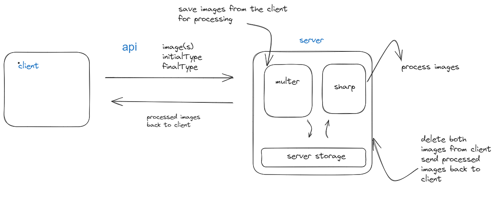
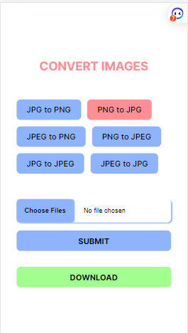
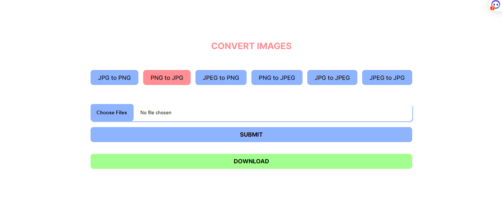

# Image Conversion Web Application

This is a full-stack image conversion web application that allows users to convert images from one format to another. The application is built using React on the frontend and Node.js with Express.js on the backend. It utilizes libraries such as Sharp to process and convert the images.

## Features

- **Image Format Conversion**: The application enables users to convert images from various formats, such as PNG to JPG or vice versa.
- **User-Friendly Interface**: The frontend is designed with a clean and intuitive user interface, providing a seamless experience for users to upload and convert images.
- **Efficient Image Processing**: The backend utilizes the Sharp library, which is known for its high-performance image processing capabilities. This ensures fast and reliable image conversions.
- **Responsive Design**: The application is fully responsive and optimized for various screen sizes, making it accessible on both desktop and mobile devices.

## Technologies Used

The application is built using the following technologies:

- Frontend:
  - React: A popular JavaScript library for building user interfaces.
  - Vite: A fast build tool that sets up React projects with instant reloading.
  - HTML/CSS: The foundation for structuring and styling the user interface.
- Backend:
  - Node.js: A JavaScript runtime environment that allows running JavaScript on the server.
  - Express.js: A web application framework for building robust APIs and web applications.
  - Sharp: A powerful image processing library for Node.js that provides efficient image conversion capabilities.
- Deployment:
  - Docker: A containerization platform used for packaging the application and its dependencies into a standardized unit.
  - Heroku: A cloud platform for deploying and hosting web applications.

## System Design



## Sample UI




## Prerequisites

To run this application locally, you need to have the following software installed on your machine:

- Node.js: You can download and install Node.js from the official website: [https://nodejs.org](https://nodejs.org)


## Getting Started

Follow these steps to get the application up and running on your local machine:

1. Clone this repository to your local machine using the following command:

   ```shell
   git clone <repository-url>
   ```

2. Navigate to the project's root directory:

   ```shell
   cd imageconvertify
   ```
3. Navigate to the project's server directory:

   ```shell
   cd server
   ```


4. Install the project dependencies by running the following command:

   ```shell
   npm install
   ```
5. Do steps 3 and 4 for the client server 
      ```shell
      cd client 
   npm install
   ```
6. Start the development server for both the client and server:

   ```shell
   npm run dev
   ```

   This will launch the frontend application at [http://localhost:5173](http://localhost:5173).

   The backend server will start running at [http://localhost:4000](http://localhost:4000).

7. Open your web browser and visit [http://localhost:5173](http://localhost:5173) to access the application.
